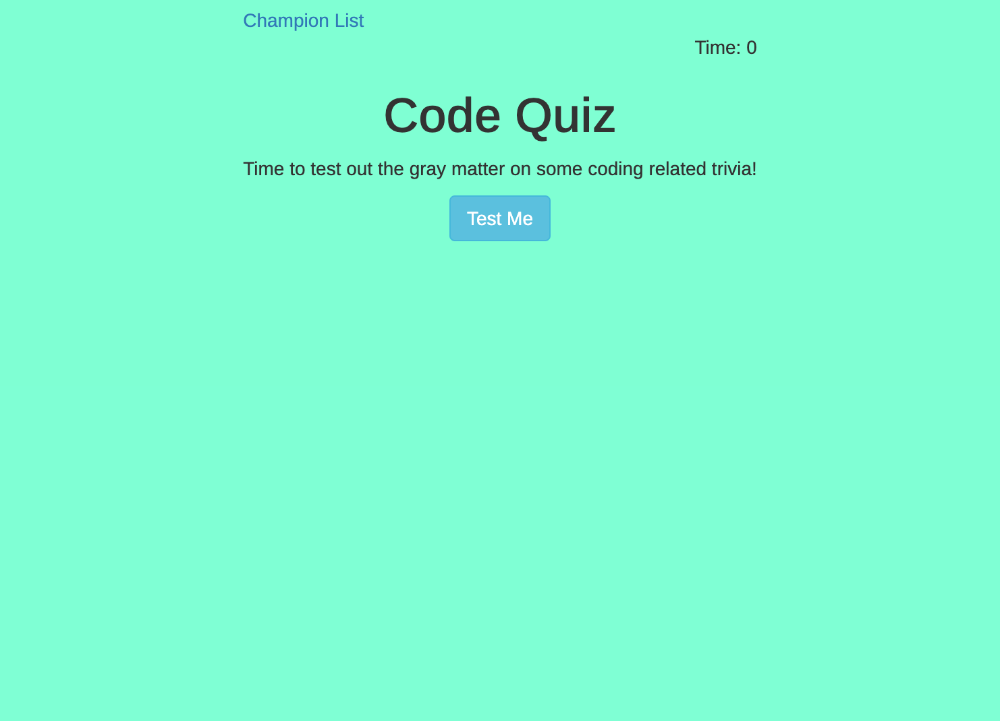

# Code-Quiz
This is a quiz with questions centering on coding. The quiz consists of 10 multiple choice questions. Time limit is 180 seconds and a deduction of 10 seconds will be made if quesitons are answered incorrectly.

## Instructions
1. Click "test me" to start the quiz. 
    * Timer will start and you will be presented with the first queston.
    * You will have 180 seconds in total. Incorrect answers will result in a 10 second penalty.
2. Once all questions have been answered or the timer reaches 0 the game will be over.
3. You will be provided with your score and will need to add your name to the champion list.
4. Champion list will display from local storage so you can track your progress.
5. You will have the option to go back to the main screen or clear the champion list.

## Link and example

* https://lukemcmi.github.io/Code-Quiz/

