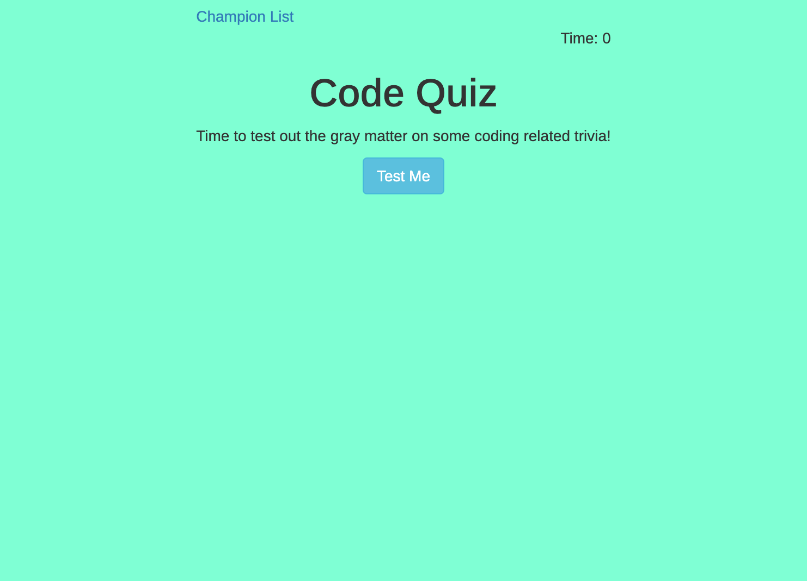

# Code-Quiz
This is a quiz with questions centering on coding. The quiz consists of 10 multiple choice questions. Time limit is 180 seconds and a deduction of 10 seconds will be made if quesitons are answered incorrectly.

## Instructions
1. Click "test me" to start the quiz. 
    * Timer will start and you will be presented with the first queston.
    * You will have 180 seconds in total. Incorrect answers will result in a 10 second penalty.
2. Once all questions have been answered or the timer reaches 0 the game will be over.
3. You will be provided with your score and will need to add your name to the champion list.
4. Champion list will display from local storage so you can track your progress.
5. You will have the option to go back to the main screen or clear the champion list.

## Link and example

* https://lukemcmi.github.io/Code-Quiz/

.png)

## Licence

MIT License

Copyright (c) 2021 Luke McMillan

Permission is hereby granted, free of charge, to any person obtaining a copy
of this software and associated documentation files (the "Software"), to deal
in the Software without restriction, including without limitation the rights
to use, copy, modify, merge, publish, distribute, sublicense, and/or sell
copies of the Software, and to permit persons to whom the Software is
furnished to do so, subject to the following conditions:

The above copyright notice and this permission notice shall be included in all
copies or substantial portions of the Software.

THE SOFTWARE IS PROVIDED "AS IS", WITHOUT WARRANTY OF ANY KIND, EXPRESS OR
IMPLIED, INCLUDING BUT NOT LIMITED TO THE WARRANTIES OF MERCHANTABILITY,
FITNESS FOR A PARTICULAR PURPOSE AND NONINFRINGEMENT. IN NO EVENT SHALL THE
AUTHORS OR COPYRIGHT HOLDERS BE LIABLE FOR ANY CLAIM, DAMAGES OR OTHER
LIABILITY, WHETHER IN AN ACTION OF CONTRACT, TORT OR OTHERWISE, ARISING FROM,
OUT OF OR IN CONNECTION WITH THE SOFTWARE OR THE USE OR OTHER DEALINGS IN THE
SOFTWARE.

